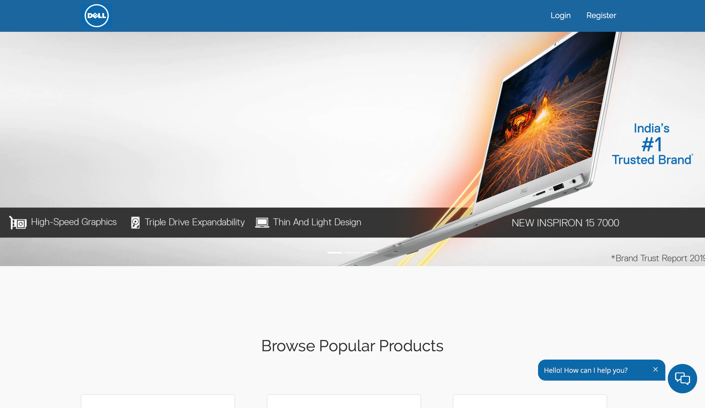
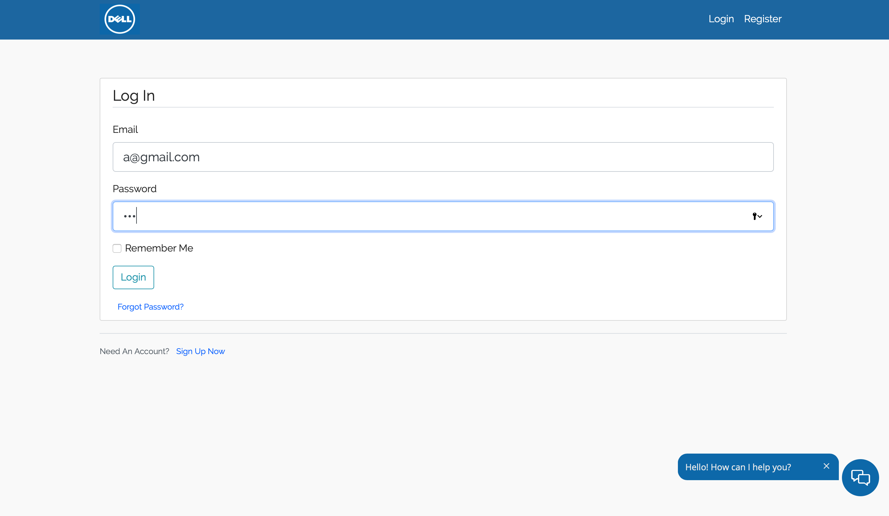
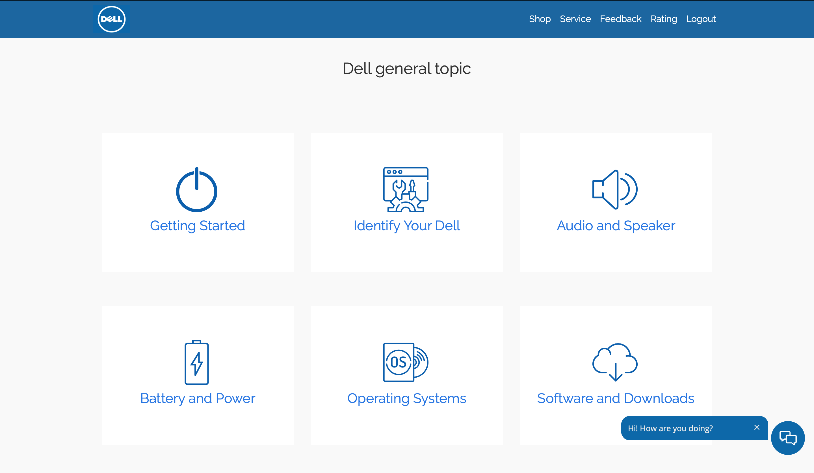
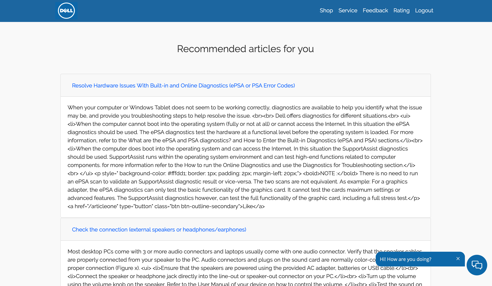
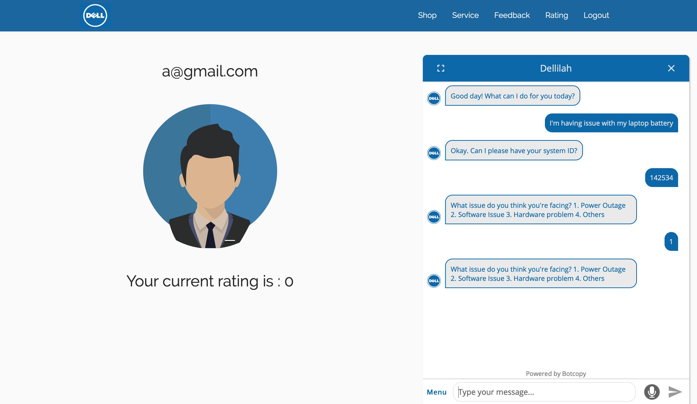
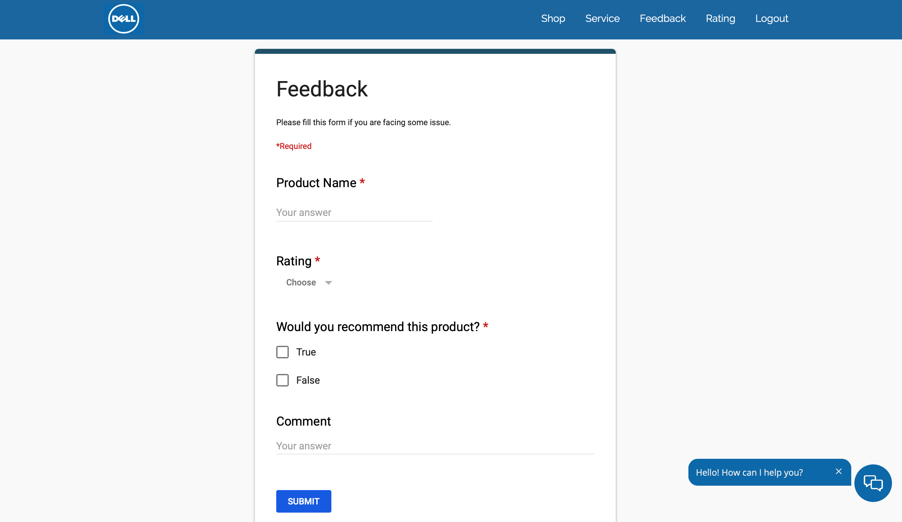
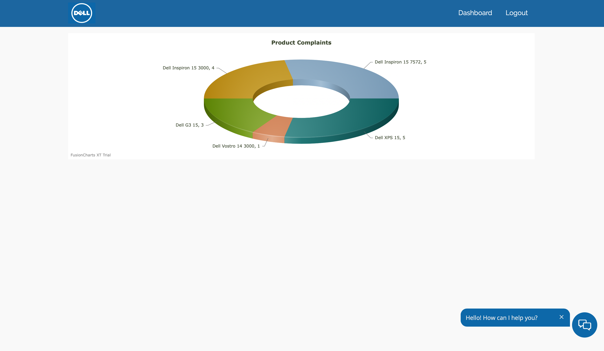

# Project-recommender-system
Contains the project created during Dell's hackathon 

Our problem statement was to improve the service and support for the organisation. So we have come up with a three part solution - recommender system being the first one, than a AI chatbot and the last one is the feedback and analysis part. While working on our problem statement we realise that that dell itself has a solution for it in terms of its detailed and comprehensice tutorials and articles but the only thing that making customer reluctant to use this resource the the amount od article they have the and the current  searching technique. even for the samllest of issue. for say if you searched battery issue the there search engine will render alll the article related to that word and containing that word which is a lot. and with coming time these articles will keep on increasing. so we have applied our recommender system which will suggest the relevent article to us based on our past product history and the issue we have faced or facing.  

### Home page

### Login page

### Article section

### Recommended Article 

### Rating and Chatbot 

### Feedback form

### Analysis dashboard

